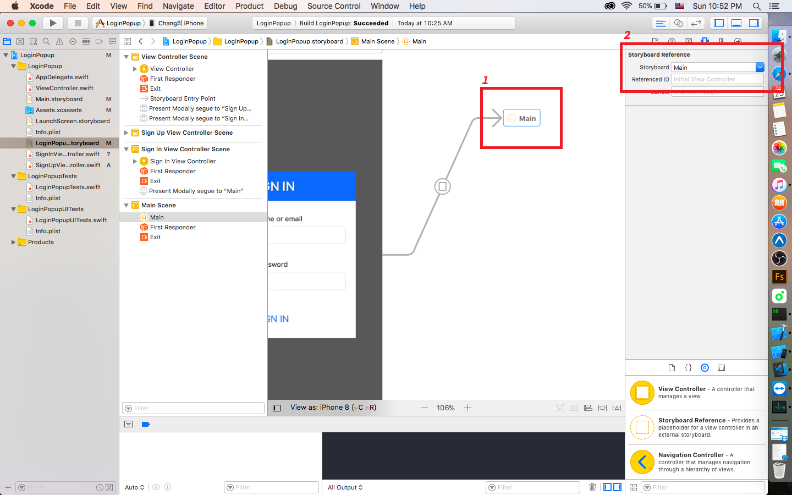

LOGINPOPUP-SWIFT

 

[Author]
    Chris Yunbin Chang

[How to Use]
    1. Add this swift files and story board in your project.
    2. Link the StoryBoard Reference that refer LoginPopup storyboard.
    3. Link the StoryBoard Reference that refer next Storyboard that will be the view after sign in.
    4. Write some lines of code in SignInTapped and SignUpTapped in swift file.

[How to Link]
{: refdef: style="text-align: center;"}
    
    
{: refdef}

[Where to Code]
{: refdef: style="text-align: center;"}
    
{: refdef}

[How To Change Animation]

{: refdef: style="text-align: center;"}
    
    1. Click the segue which you want to change animation.
    2. Choose Presentation Type.
{: refdef}

[Sample]
{: refdef: style="text-align: center;"}
    
{: refdef}

